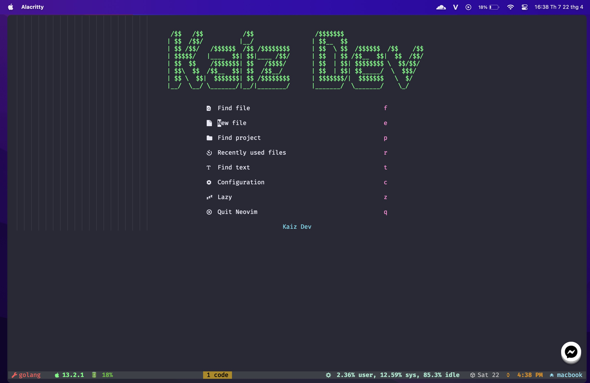

# NvChad-v2-config

## Dashboard



## Install

1. Install Neovim 8.0+ https://github.com/neovim/neovim/releases/tag/v0.8.1
2. C++ (windows) Compiler https://www.msys2.org/
3. GIT https://git-scm.com/download/win
4. NodeJs https://nodejs.org/en/
5. Ripgrep https://github.com/BurntSushi/ripgrep
6. Lazygit https://github.com/jesseduffield/lazygit
7. Nerd Font https://github.com/ryanoasis/nerd-fonts

# Config brew (Macos)

- Lakukan install Neovim dari link No 1 diatas

```
brew install wget
brew install neovim
nvchad
git clone https://github.com/NvChad/NvChad ~/.config/nvim --depth 1 && nvim
nvim --version
```

- Check ketersediaan GCC

```
gcc --version
```

- Install git

```
brew install git
git --version
```

- Install NodeJS

```
curl -o- https://raw.githubusercontent.com/nvm-sh/nvm/v0.39.3/install.sh | bash
export NVM_DIR="$([ -z "${XDG_CONFIG_HOME-}" ] && printf %s "${HOME}/.nvm" || printf %s "${XDG_CONFIG_HOME}/nvm")"
[ -s "$NVM_DIR/nvm.sh" ] && \. "$NVM_DIR/nvm.sh" # This loads nvm
~/.zshrc
nvm install 18.12.1
node --version
npm --version
```

- Install unzip, ripgrep

```
brew install unzip
brew install ripgrep
```

- Install Lazygit

```
brew install lazygit
lazygit --version
```

## Config Linux / MAC

- Rename Config Original

```
mv ~/.config/nvim/lua/custom/ ~/.config/nvim/lua/custom_backup
```

- Clone Config Kai Dev

```
git clone https://github.com/kaidev0711/nvchad-v2.git ~/.config/nvim/lua/custom
```
